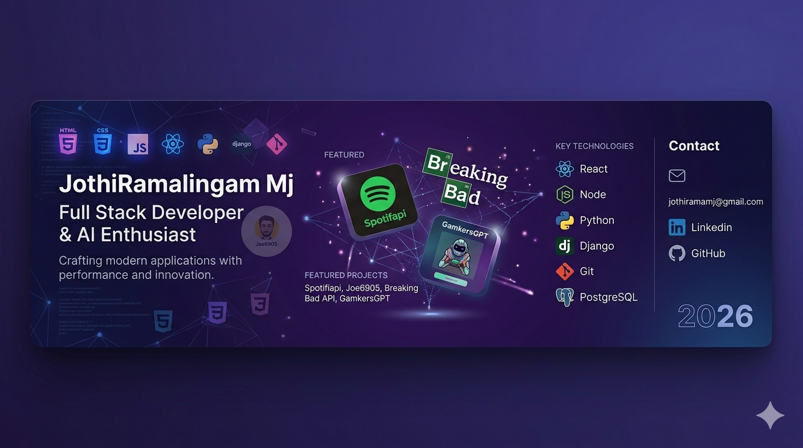

# Joi Music 🎵

A creative, dark-purple themed Spotify web clone built with React and TypeScript. Joi Music offers a polished, immersive experience for music lovers, focusing on speed, accessibility, and impressive design.

## ✨ Features

- **Creative Branding**: Unique "Joi Music" identity with a custom dark-purple aesthetic.
- **Token-Based Authentication**: Access the full Spotify library using a temporary access token.
- **Real-Time Playback**: Integrated Spotify Web Playback SDK for seamless music streaming.
- **Smart Search**: Quickly find tracks, artists, and albums.
- **Personalized Mixes**: View your top tracks and curated categories.
- **Motion UI**: Smooth animations and transitions powered by `motion`.
- **Responsive Design**: Optimized for a great experience on any device.

## 🚀 Tech Stack

- **Frontend**: React 19, TypeScript
- **Styling**: Tailwind CSS (v4)
- **Animations**: Framer Motion (`motion/react`)
- **Icons**: Lucide React
- **API**: Spotify Web API (via `spotify-web-api-js`)
- **Player**: `react-spotify-web-playback`

## 🛠️ Getting Started

### Prerequisites

To use Joi Music, you need a **Spotify Premium** account and a temporary **Access Token**.

### How to get an Access Token

1.  Visit the [Spotify Developer Dashboard](https://developer.spotify.com/documentation/web-playback-sdk/tutorials/get-your-token).
2.  Log in with your Spotify account.
3.  Click **"Get Token"**.
4.  Ensure you select the necessary scopes (e.g., `streaming`, `user-read-email`, `user-read-private`, `user-top-read`).
5.  Copy the generated token.

### Usage

1.  Open the Joi Music application.
2.  Paste your copied Access Token into the input field.
3.  Click **"Connect to Joi"**.
4.  Start searching and playing your favorite tracks!

## 🎨 Design Philosophy

Joi Music follows a "Mood First" design approach:
- **Color Palette**: Deep purples (`#0a0118`, `#1a0b2e`) paired with vibrant brand accents (`#8b5cf6`).
- **Typography**: Clean, modern sans-serif for high legibility.
- **Interactions**: Subtle hover effects and staggered entrances to guide user attention.

## 📄 License

This project is licensed under the Apache-2.0 License.
